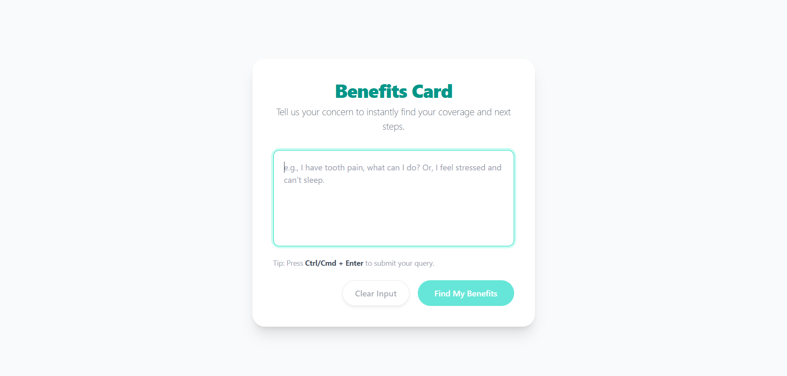

# AI-Powered Benefits Recommendation App

## Overview
This app uses AI to classify user health queries into allowed categories (Dental, Mental Health, Vision, OPD) and generates mock benefit cards and action plans. It features a modern React/TypeScript frontend with Tailwind CSS, OpenRouter API integration, and robust navigation and state management.

---

## Prompts Used & Refinements
- **Classification Prompt:**
  > "You are a helpful assistant for a healthcare benefits app. Classify the user's health issue into one category: Dental, Mental Health, Vision, OPD only else nothing. Then create 2 to 4 mock benefit cards with fields: title, coverage, description. Finally, provide a 3-step action plan for each benefit. Return the result strictly in this JSON format: { category, benefits, actionPlan }"
- **Action Plan Prompt:**
  > "You are an assistant that creates clear 3-step action plans for availing health benefits. Return the result as JSON array of strings: [Step 1, Step 2, Step 3]"
- **Refinements:**
  - Enforced strict JSON output for easier parsing.
  - Limited categories to allowed set using `categoryGuard`.
  - Added UI feedback for disallowed categories and navigation to re-query.

---

## Architecture & State Management
- **Frontend:** React (TypeScript)
- **Styling:** Tailwind CSS
- **API Integration:** OpenRouter API via `aiServices.ts`, API key managed with Vite `.env`.
- **State Management:**
  - Main state (user input, category, benefits, dark mode) managed in `App.tsx` using React hooks (`useState`).
  - Navigation between steps handled by conditional rendering and state transitions.
  - Category validation via `utils/categoryGuard.ts`.
- **Component Structure:**
  - `BenefitInput`: User query input
  - `CategoryStep`: Shows AI-chosen category, navigation, and re-query option
  - `BenefitList`: Renders benefit cards
  - `BenefitDetails`: Shows action plan for selected benefit

---

## Screenshots

| Query Input Screen | Category Step | Benefit Cards | Dark Mode Toggle |
|-------------------|--------------|--------------|------------------|
|  |  |  |  |

---

## Known Issues & Potential Improvements
- **Known Issues:**
  - Occasional API response formatting errors (non-JSON output).
  - No persistent storage; all state is in-memory.
  - Limited error handling for network/API failures.
- **Potential Improvements:**
  - Add persistent storage (localStorage or backend).
  - Improve error handling and user feedback.
  - Add more allowed categories and refine prompts.
  - Enhance mobile responsiveness and accessibility.
  - Add unit and integration tests.
  - Support for multiple languages.

---

## Getting Started
1. Clone the repo and install dependencies:
   ```sh
   git clone https://github.com/uvraviz007/AI-Generated-Wellness-Recommendation-Board.git
   cd ai-benefits-flow
   npm install
   ```
2. Add your OpenRouter API key to `.env`:
   ```env
   VITE_OPENROUTER_API_KEY=your_api_key_here
   ```
3. Start the development server:
   ```sh
   npm run dev
   ```

---

## License
MIT

---

# React + TypeScript + Vite

This template provides a minimal setup to get React working in Vite with HMR and some ESLint rules.

Currently, two official plugins are available:

- [@vitejs/plugin-react](https://github.com/vitejs/vite-plugin-react/blob/main/packages/plugin-react) uses [Babel](https://babeljs.io/) for Fast Refresh
- [@vitejs/plugin-react-swc](https://github.com/vitejs/vite-plugin-react/blob/main/packages/plugin-react-swc) uses [SWC](https://swc.rs/) for Fast Refresh

## React Compiler

The React Compiler is not enabled on this template because of its impact on dev & build performances. To add it, see [this documentation](https://react.dev/learn/react-compiler/installation).

## Expanding the ESLint configuration

If you are developing a production application, we recommend updating the configuration to enable type-aware lint rules:

```js
export default defineConfig([
  globalIgnores(['dist']),
  {
    files: ['**/*.{ts,tsx}'],
    extends: [
      // Other configs...

      // Remove tseslint.configs.recommended and replace with this
      tseslint.configs.recommendedTypeChecked,
      // Alternatively, use this for stricter rules
      tseslint.configs.strictTypeChecked,
      // Optionally, add this for stylistic rules
      tseslint.configs.stylisticTypeChecked,

      // Other configs...
    ],
    languageOptions: {
      parserOptions: {
        project: ['./tsconfig.node.json', './tsconfig.app.json'],
        tsconfigRootDir: import.meta.dirname,
      },
      // other options...
    },
  },
])
```

You can also install [eslint-plugin-react-x](https://github.com/Rel1cx/eslint-react/tree/main/packages/plugins/eslint-plugin-react-x) and [eslint-plugin-react-dom](https://github.com/Rel1cx/eslint-react/tree/main/packages/plugins/eslint-plugin-react-dom) for React-specific lint rules:

```js
// eslint.config.js
import reactX from 'eslint-plugin-react-x'
import reactDom from 'eslint-plugin-react-dom'

export default defineConfig([
  globalIgnores(['dist']),
  {
    files: ['**/*.{ts,tsx}'],
    extends: [
      // Other configs...
      // Enable lint rules for React
      reactX.configs['recommended-typescript'],
      // Enable lint rules for React DOM
      reactDom.configs.recommended,
    ],
    languageOptions: {
      parserOptions: {
        project: ['./tsconfig.node.json', './tsconfig.app.json'],
        tsconfigRootDir: import.meta.dirname,
      },
      // other options...
    },
  },
])
```
